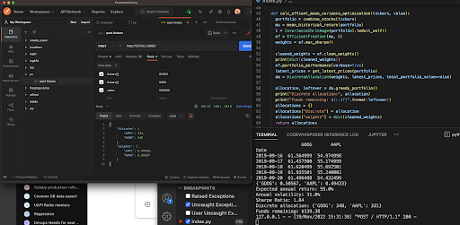

# Welcome to this microservice portfolio optimization

## inorder to understands the code and logic refer to index.py

### and that's how you run this code in development

``` bash
export FLASK_APP=index.py
export FLASK_ENV=development
flask run
```
